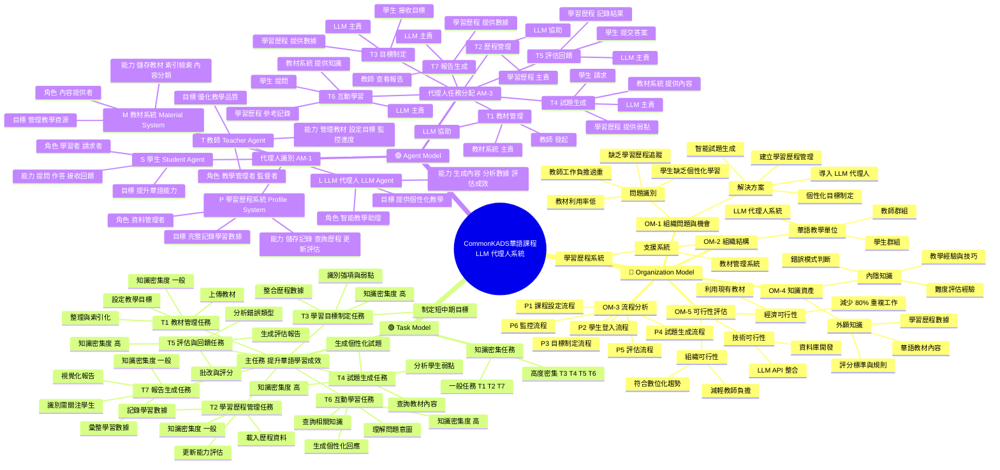

# CommonKADS 華語課程 LLM 代理人系統分析

## 目錄
- [1. Organization Model（組織模型）](#1-organization-model組織模型)
- [2. Task Model（任務模型）](#2-task-model任務模型)
- [3. Agent Model（代理人模型）](#3-agent-model代理人模型)
- [4. 系統整合總結](#4-系統整合總結)

---

## 1. Organization Model（組織模型）

### OM-1: 組織問題與機會

#### 問題識別
- 教師工作負擔過重（批改、出題）
- 學生缺乏個性化學習路徑
- 無法即時掌握學習成效
- 教材利用率低，重複製作內容
- 缺乏系統化的學習歷程追蹤

#### 解決方案
- 導入 LLM 代理人自動化系統
- 建立學習歷程管理機制
- 開發智能試題生成功能
- 實現個性化學習目標制定
- 整合現有教材資源

---

### OM-2: 組織結構

```
華語教學單位
├── 教師群組
├── LLM 代理人系統
│   ├── 學習歷程系統
│   └── 教材管理系統
└── 學生群組
```

#### 組織層級
1. **最高層**: 華語教學單位
2. **中間層**: 教師群組、LLM 代理人系統、學生群組
3. **支援系統**: 學習歷程系統、教材管理系統

---

### OM-3: 流程分析（對應 UML 6 個階段）

| 流程編號 | 流程名稱 | 流程內容 |
|---------|---------|---------|
| **P1** | 課程設定流程 | 教師上傳教材 → 系統整理 → 設定目標 → LLM 載入教材 |
| **P2** | 學生登入流程 | 學生登入 → 載入學習歷程 → LLM 分析程度 |
| **P3** | 目標制定流程 | 整合歷程 → 分析弱點 → 制定目標 → 呈現給學生 |
| **P4** | 試題生成流程 | 請求試題 → 獲取教材 → 查詢弱點 → 生成試題 → 呈現給學生 |
| **P5** | 評估流程 | 學生作答 → LLM 批改 → 分析錯誤 → 記錄歷程 → 呈現報告 |
| **P6** | 監控流程 | 教師查看報告 → 分析學生表現 → 調整教學策略 |

---

### OM-4: 知識資產

#### 內隱知識（Tacit Knowledge）
- 教師的教學經驗與技巧
- 學生常見錯誤模式判斷
- 難度評估與調整經驗
- 個別學生學習特性理解
- 華語教學法知識

#### 外顯知識（Explicit Knowledge）
- 現有華語教材內容
- 學習歷程數據記錄
- 試題題庫與答案
- 評分標準與規則
- 課程大綱與目標

---

### OM-5: 可行性評估

#### 💰 經濟可行性
**成本效益分析：**
- ✅ 減少 80% 重複工作
- ✅ 利用現有教材資源
- ✅ LLM API 成本可控
- ✅ 提升教學效率 3-5 倍

#### ⚙️ 技術可行性
**技術需求：**
- ✅ LLM API 整合
- ✅ 學習歷程資料庫
- ✅ 教材管理系統
- ✅ Web 介面開發

#### 👥 組織可行性
**接受度評估：**
- ✅ 減輕教師負擔高接受度
- ✅ 學生喜愛即時回饋
- ✅ 管理層支持創新
- ✅ 符合教育數位化趨勢

---

## 2. Task Model（任務模型）

### 任務階層結構（TM-1）

#### 主任務：提升華語學習成效

##### T1: 教材管理任務
- **T1.1**: 上傳教材
- **T1.2**: 整理教材內容
- **T1.3**: 設定教學目標
- **T1.4**: 教材內容索引化
- **知識密集度**: 一般

##### T2: 學習歷程管理任務
- **T2.1**: 載入學生歷程資料
- **T2.2**: 分析學習狀況
- **T2.3**: 記錄學習數據
- **T2.4**: 更新能力評估
- **知識密集度**: 一般

##### T3: 學習目標制定任務 ⭐
- **T3.1**: 整合歷程數據
- **T3.2**: 識別強項與弱點
- **T3.3**: 制定短中期目標
- **T3.4**: 呈現學習目標給學生
- **知識密集度**: 高（需要教學經驗與學習理論知識）

##### T4: 試題生成任務 ⭐
- **T4.1**: 接收試題請求
- **T4.2**: 查詢相關教材
- **T4.3**: 分析學生弱點
- **T4.4**: 生成個性化試題
- **T4.5**: 呈現試題給學生
- **知識密集度**: 高（需要教材理解與難度控制）

##### T5: 評估與回饋任務 ⭐
- **T5.1**: 接收學生答案
- **T5.2**: 批改與評分
- **T5.3**: 分析錯誤類型
- **T5.4**: 生成評估報告
- **T5.5**: 記錄到學習歷程
- **知識密集度**: 高（需要錯誤分析與教學診斷）

##### T6: 互動學習任務 ⭐
- **T6.1**: 接收學生問題
- **T6.2**: 理解問題意圖
- **T6.3**: 查詢相關知識
- **T6.4**: 生成個性化回應
- **T6.5**: 記錄互動數據
- **知識密集度**: 高（需要語言理解與教學策略）

##### T7: 報告生成任務
- **T7.1**: 彙整學習數據
- **T7.2**: 生成視覺化報告
- **T7.3**: 識別需關注學生
- **T7.4**: 提供教學建議
- **知識密集度**: 一般

---

### 知識密集任務分析（TM-2）

#### 高度知識密集任務
| 任務 | 描述 | 原因 |
|------|------|------|
| **T3** | 目標制定 | 需要教學經驗與學習理論知識 |
| **T4** | 試題生成 | 需要教材理解與難度控制 |
| **T5** | 評估回饋 | 需要錯誤分析與教學診斷 |
| **T6** | 互動學習 | 需要語言理解與教學策略 |

#### 一般知識任務
| 任務 | 描述 | 原因 |
|------|------|------|
| **T1** | 教材管理 | 主要是資料處理與組織 |
| **T2** | 歷程管理 | 資料庫操作與記錄管理 |
| **T7** | 報告生成 | 資料彙整與視覺化呈現 |

---

## 3. Agent Model（代理人模型）

### 代理人識別與特性（AM-1）

#### 🔴 學生（Student Agent）
- **角色**: 學習者、任務請求者
- **能力**:
  - 提出問題與需求
  - 完成練習與試題
  - 接收回饋與建議
- **目標**: 提升華語能力

#### 🟣 LLM 代理人（LLM Agent）
- **角色**: 智能教學助理、核心處理者
- **能力**:
  - 理解自然語言問題
  - 生成個性化內容
  - 分析學習數據
  - 制定學習策略
  - 評估學習成效
- **目標**: 提供個性化教學支援

#### 🟢 教師（Teacher Agent）
- **角色**: 教學管理者、監督者
- **能力**:
  - 上傳與管理教材
  - 設定教學目標
  - 監控學習進度
  - 查看學習報告
  - 調整教學策略
- **目標**: 優化教學品質、減輕工作負擔

#### 🟡 學習歷程系統（Profile System）
- **角色**: 資料管理者、記憶系統
- **能力**:
  - 儲存學習記錄
  - 提供歷程查詢
  - 更新能力評估
  - 追蹤學習軌跡
- **目標**: 完整記錄學習歷程數據

#### 🔵 教材系統（Material System）
- **角色**: 內容提供者、知識庫
- **能力**:
  - 儲存教材內容
  - 索引與檢索
  - 內容分類管理
  - 提供教材查詢
- **目標**: 有效管理與提供教學資源

---

### 代理人任務分配（AM-3）

| 任務 | 學生 | LLM 代理人 | 學習歷程 | 教材系統 | 教師 |
|------|------|-----------|---------|---------|------|
| **T1: 教材管理** | - | 協助 | - | **主責** | 發起 |
| **T2: 歷程管理** | - | 協助 | **主責** | - | - |
| **T3: 目標制定** | 接收 | **主責** | 提供數據 | - | - |
| **T4: 試題生成** | 請求 | **主責** | 提供弱點 | 提供內容 | - |
| **T5: 評估回饋** | 提交答案 | **主責** | 記錄結果 | - | - |
| **T6: 互動學習** | 提問 | **主責** | 提供參考 | 提供知識 | - |
| **T7: 報告生成** | - | **主責** | 提供數據 | - | 查看 |

#### 角色說明
- **主責**: 該任務的主要執行者
- **協助**: 提供支援與協助
- **發起**: 啟動任務
- **提供**: 提供資料或內容
- **請求**: 發起請求
- **接收**: 接收結果
- **查看**: 查看報告

---

## 4. 系統整合總結

### CommonKADS 三大模型關係

```
🏢 Organization Model
   ↓ 定義問題、流程與可行性
📋 Task Model
   ↓ 分解任務與識別知識點
🤖 Agent Model
   ↓ 分配代理人與協作機制
✅ 華語學習成效提升
```

### 核心價值鏈

**組織問題識別** → **任務分解執行** → **代理人協作** → **提升學習成效**

### 系統特色

1. **📊 數據驅動**: 基於學習歷程的個性化決策
2. **🎯 目標導向**: AI 制定明確學習目標
3. **📝 智能測驗**: 自動生成試題並評估
4. **🔄 持續優化**: 根據數據不斷調整策略
5. **⚡ 效率提升**: 減少 80% 教師重複性工作

### 預期效益

#### 對學生
- ✅ 獲得個性化學習路徑
- ✅ 即時回饋與評估
- ✅ 明確的學習目標
- ✅ 針對性的弱點改善

#### 對教師
- ✅ 大幅減輕工作負擔
- ✅ 數據化學生管理
- ✅ 自動化出題與批改
- ✅ 精準掌握教學成效

#### 對組織
- ✅ 提升整體教學品質
- ✅ 充分利用現有資源
- ✅ 符合數位轉型趨勢
- ✅ 建立競爭優勢

---

## Mermaid 腦圖



---

**文件版本**: 1.0  
**建立日期**: 2026-03-04  
**系統名稱**: 華語課程 LLM 代理人系統  
**方法論**: CommonKADS 知識工程方法論
