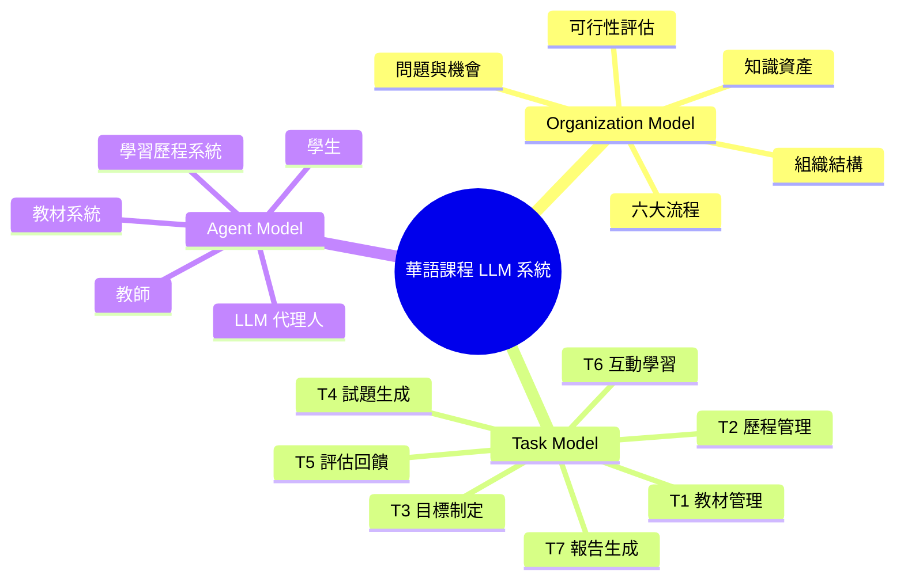
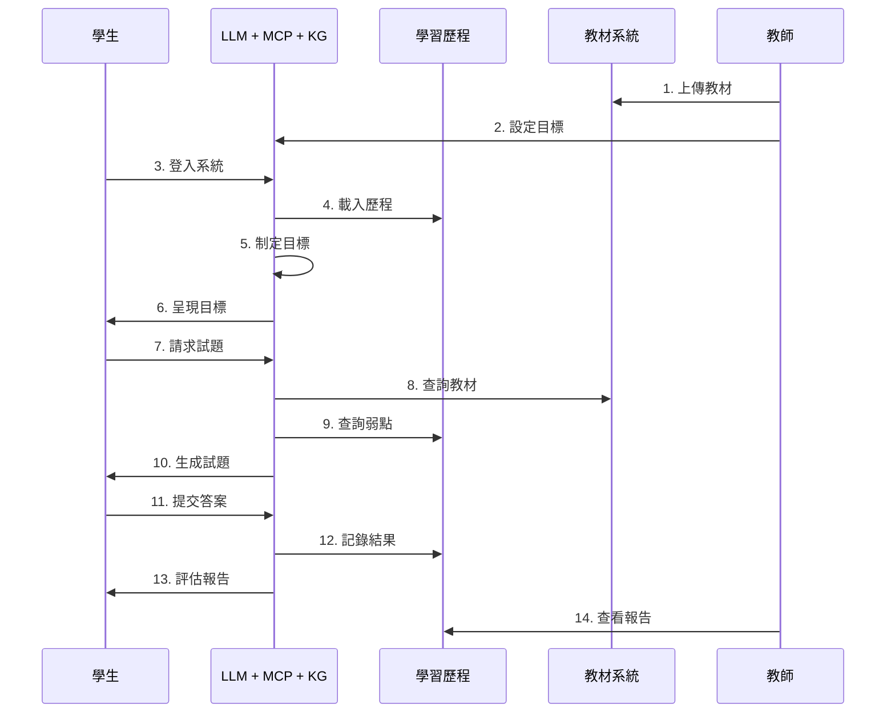

# 華語課程 LLM 代理人系統 - CommonKADS 分析

> **系統目標**: 利用 LLM 代理人提升華語學習成效，減輕教師負擔，實現個性化學習

---

## 一、Organization Model (組織模型)

### 1. OM-1: 問題與解決方案

**現況問題**
- 教師批改、出題工作負擔重
- 學生學習缺乏個性化路徑
- 無法即時掌握學習成效
- 教材重複製作，利用率低
- 學習歷程追蹤不系統化

**導入方案**
- LLM 代理人自動化系統
- 學習歷程 (Learning Profile) 管理
- 智能試題自動生成
- 個性化學習目標制定
- 整合利用現有教材

---

### 2. OM-2: 組織架構

```
華語教學單位
│
├─ 教師群組 (管理、監督)
├─ LLM 代理人系統 (核心智能)
│  ├─ 學習歷程系統
│  └─ 教材管理系統
└─ 學生群組 (學習、互動)
```

---

### 3. OM-3: 六大流程

| # | 流程 | 說明 |
|---|------|------|
| P1 | 課程設定 | 教師上傳教材 → 系統整理 → 設定目標 |
| P2 | 學生登入 | 登入 → 載入學習歷程 → 分析程度 |
| P3 | 目標制定 | 整合歷程 → 分析弱點 → 制定目標 |
| P4 | 試題生成 | 查詢教材與弱點 → 生成個性化試題 |
| P5 | 評估回饋 | 批改 → 分析錯誤 → 記錄歷程 → 生成報告 |
| P6 | 教師監控 | 查看報告 → 分析表現 → 調整策略 |

---

### 4. OM-4: 知識資產

**內隱知識** (從教師經驗中獲取)
- 教學經驗與技巧
- 學生錯誤模式判斷
- 難度評估與調整經驗

**外顯知識** (系統化資料)
- 華語教材內容
- 學習歷程數據
- 試題題庫與評分標準

---

### 5. OM-5: 可行性

| 面向 | 評估 |
|------|------|
| 💰 **經濟** | 減少 80% 重複工作，利用現有教材，成本可控 |
| ⚙️ **技術** | LLM API、資料庫、Web 介面技術成熟 |
| 👥 **組織** | 教師、學生接受度高，符合數位化趨勢 |

---

## 二、Task Model (任務模型)

### 主任務: 提升華語學習成效

#### 任務分解

**T1. 教材管理** (知識密集度: 低)
- 上傳教材
- 整理與索引化
- 設定教學目標

**T2. 學習歷程管理** (知識密集度: 低)
- 載入歷程資料
- 記錄學習數據
- 更新能力評估

**T3. 學習目標制定** ⭐ (知識密集度: 高)
- 整合歷程數據
- 識別強項與弱點
- 制定短中期目標

**T4. 試題生成** ⭐ (知識密集度: 高)
- 查詢教材內容
- 分析學生弱點
- 生成個性化試題

**T5. 評估與回饋** ⭐ (知識密集度: 高)
- 批改與評分
- 分析錯誤類型
- 生成評估報告

**T6. 互動學習** ⭐ (知識密集度: 高)
- 理解問題意圖
- 查詢相關知識
- 生成個性化回應

**T7. 報告生成** (知識密集度: 低)
- 彙整學習數據
- 視覺化呈現
- 識別需關注學生

---

### 知識密集度分析

**高密集任務** (需 LLM 核心能力)
- T3: 目標制定 - 需教學經驗與理論
- T4: 試題生成 - 需教材理解與難度控制
- T5: 評估回饋 - 需錯誤分析與診斷
- T6: 互動學習 - 需語言理解與策略

**一般任務** (資料處理為主)
- T1: 教材管理
- T2: 歷程管理
- T7: 報告生成

---

## 三、Agent Model (代理人模型)

### 五大代理人

#### 🔴 學生 (Student)
**角色**: 學習者  
**能力**: 提問、作答、接收回饋  
**目標**: 提升華語能力

#### 🟣 LLM 代理人 (LLM Agent)
**角色**: 智能教學助理 (核心)  
**能力**: 理解問題、生成內容、分析數據、制定策略、評估成效  
**目標**: 提供個性化教學支援

#### 🟢 教師 (Teacher)
**角色**: 教學管理者  
**能力**: 管理教材、設定目標、監控進度、查看報告  
**目標**: 優化教學品質、減輕負擔

#### 🟡 學習歷程系統 (Learning Profile)
**角色**: 資料管理者  
**能力**: 儲存記錄、查詢歷程、更新評估  
**目標**: 完整記錄學習數據

#### 🔵 教材系統 (Material System)
**角色**: 內容提供者  
**能力**: 儲存教材、索引檢索、內容分類  
**目標**: 管理教學資源

---

### 任務分配矩陣

| 任務 | 學生 | LLM | 歷程 | 教材 | 教師 |
|------|:----:|:---:|:----:|:----:|:----:|
| T1 教材管理 | - | 協助 | - | **主責** | 發起 |
| T2 歷程管理 | - | 協助 | **主責** | - | - |
| T3 目標制定 | 接收 | **主責** | 提供 | - | - |
| T4 試題生成 | 請求 | **主責** | 提供 | 提供 | - |
| T5 評估回饋 | 提交 | **主責** | 記錄 | - | - |
| T6 互動學習 | 提問 | **主責** | 參考 | 提供 | - |
| T7 報告生成 | - | **主責** | 提供 | - | 查看 |

**說明**: 
- **主責** = 主要執行者
- **提供** = 提供資料/內容
- **協助** = 輔助支援

---

## 四、系統整合與價值

### 核心價值鏈

```
識別問題 → 分解任務 → 代理人協作 → 提升成效
   OM         TM           AM          成果
```

### 關鍵特色

1. **數據驅動**: 基於學習歷程的決策
2. **目標導向**: AI 制定明確目標
3. **智能測驗**: 自動生成與評估
4. **持續優化**: 循環改進機制
5. **效率提升**: 減少 80% 重複工作

---

### 預期效益

**學生端**
- ✅ 個性化學習路徑
- ✅ 即時回饋與評估
- ✅ 明確學習目標
- ✅ 針對弱點改善

**教師端**
- ✅ 大幅減輕工作負擔
- ✅ 數據化學生管理
- ✅ 自動出題與批改
- ✅ 精準掌握成效

**組織端**
- ✅ 提升教學品質
- ✅ 充分利用資源
- ✅ 數位轉型落實
- ✅ 建立競爭優勢

---

## 附錄: Mermaid 視覺化

### 系統架構腦圖



### UML 序列圖概念



---

**版本**: 2.0 (簡潔版)  
**日期**: 2026-03-04  
**方法論**: CommonKADS
